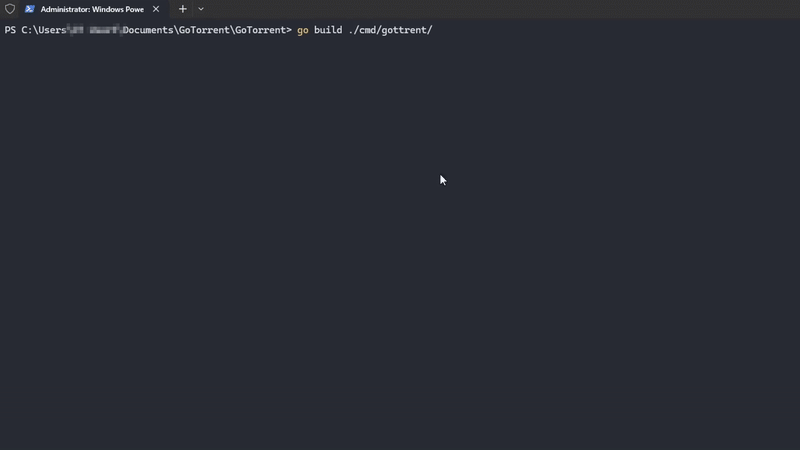

# GoTorrent

<p align="center">
  
</p>
<p align="center">
  <em>A feature-rich BitTorrent client written from scratch in Go, with zero external dependencies.</em>
</p>
<p align="center">
    <a href="https://github.com/Oblutack/GoTorrent/actions/workflows/go.yml">
        
    </a>
    <a href="https://goreportcard.com/report/github.com/Oblutack/GoTorrent">
        
    </a>
    <a href="https://github.com/Oblutack/GoTorrent/blob/main/LICENSE">
        
    </a>
    
</p>

## About The Project

**GoTorrent** is a BitTorrent client implemented entirely from scratch in Go — bencode, the peer wire protocol, trackers (HTTP and UDP), mainline DHT, and everything else, hand-rolled with no third-party dependencies. It started as a deep dive into network programming and Go concurrency, and grew into a client with real feature parity: magnet links, a modern peer-discovery stack (DHT/PEX/LSD), and the kind of day-to-day features a client like qBittorrent or µTorrent has — queueing, bandwidth scheduling, categories, an IP filter, proxy support, and more.

It's still, first and foremost, an educational project and a demonstration of skills — not an attempt to replace a mature client for daily use — but it's well past "toy" at this point: a magnet link with zero trackers downloads over DHT alone, and the CLI runs a full multi-torrent fleet with persistence across restarts.

### Key Features

**Core protocol**
- Custom bencode codec, `.torrent` parsing, and SHA-1 piece verification, all with no external dependencies.
- Full peer wire protocol: handshake, choke/interest, have/bitfield, request/piece/cancel, and the Fast extension (BEP 6) for downloading during choke.
- Rarest-first (with reservoir-sampled tie-breaking) and sequential piece selection, adaptive per-peer pipelining, and endgame mode.
- Real tit-for-tat choking with an optimistic-unchoke slot.

**Magnet links and peer discovery**
- Magnet URIs, including fetching the info dictionary over BEP 9 metadata exchange straight from peers.
- Mainline DHT (BEP 5), HTTP/HTTPS and UDP (BEP 15) trackers, peer exchange (BEP 11), and local service discovery (BEP 14) — a magnet link with no trackers at all still finds peers and downloads through DHT alone.
- Inbound connections with automatic UPnP/NAT-PMP port mapping, and private-torrent compliance (BEP 27: no DHT/PEX/LSD for a private swarm).

**Client features**
- Multi-torrent fleet management with a persisted manifest — add, list, remove, and pick everything back up automatically after a restart.
- Per-file selection and priority (skip / low / normal / high), with first-and-last-piece-first for previewable partial downloads.
- Queueing: max active downloads/seeds/total, reorderable queue positions, and force-start.
- Bandwidth: global and per-torrent rate limits that compose together, per-torrent upload slots, a LAN-exclusion option, and a weekly alternative-speed schedule.
- Seeding policy: ratio and seed-time limits that pause a torrent automatically.
- Organization: categories with per-category save paths, tags, a watch folder, content-layout options, moving a torrent's data after the fact, and running a command on completion.
- Torrent creation and maintenance: build a new `.torrent` from a file or directory, verify existing data on disk in parallel, add a tracker to a running torrent, and export a `.torrent` file from a magnet once its metadata arrives.

**Networking and privacy**
- SOCKS5 and HTTP CONNECT proxy support for peer connections and HTTP(S) tracker announces, with an option to resolve DNS through the proxy too.
- An IP filter with eMule `ipfilter.dat` and PeerGuardian `.p2p` blocklist support, including auto-update from a URL.
- Anonymous mode: a fingerprint-free peer ID, LSD disabled, and a hard refusal to start without an actual proxy configured.

## Built With

- **Language:** Go 1.24+, no external dependencies anywhere in the module.
- **Concurrency:** an actor per torrent (one goroutine owning that torrent's state, everything else talking to it over channels) plus goroutines for every peer connection, tracker announce loop, and background service.
- **Networking:** the standard `net` and `net/http` packages only — TCP, UDP, and TLS are all hand-driven, including the DHT and UDP tracker wire formats.
- **Testing:** the standard `testing` package, with real fixtures (real loopback sockets, real fake peers and trackers) rather than mocks wherever the code touches the network or disk.
- **CI/CD:** GitHub Actions, gating every push and PR on `gofmt`, `go vet`, a build, and `go test -race`.

---

## Getting Started

### Prerequisites

- **Go 1.24 or newer** — [https://golang.org/doc/install](https://golang.org/doc/install)

### Installation & Usage

1. **Clone the repository:**
   ```sh
   git clone https://github.com/Oblutack/GoTorrent.git
   cd GoTorrent
   ```

2. **Build the client:**
   ```sh
   go build ./cmd/gottrent/
   ```
   This produces `gottrent.exe` (Windows) or `gottrent` (Linux/macOS) in the current directory.

### Running the client

`gottrent` is a fleet manager: `-torrent` may be repeated, and torrents added in a previous run are picked back up automatically from the manifest even with no `-torrent` flags at all.

```sh
# Download a torrent into the current directory
./gottrent -torrent "path/to/your.torrent"

# A magnet link, into a specific directory, with verbose logging
./gottrent -torrent "magnet:?xt=urn:btih:..." -dir downloads -verbose

# Several torrents at once, with a global download cap and a queue limit
./gottrent -torrent a.torrent -torrent b.torrent -down-limit 2048 -max-active-downloads 2
```

Run `./gottrent -h` for the full flag list (30+ flags across networking, bandwidth, queueing, organization, and privacy). The most commonly used ones:

| Flag | What it does |
|---|---|
| `-torrent <path\|magnet>` | Add a torrent or magnet link (repeatable) |
| `-dir <path>` | Where to save downloaded files |
| `-port <n>` / `-random-port` | Listen port for inbound connections |
| `-down-limit` / `-up-limit <KiB/s>` | Fleet-wide bandwidth caps |
| `-ratio-limit` / `-seed-time-limit` | Pause a torrent once it's seeded enough |
| `-max-active-downloads` / `-max-active-seeds` | Queue limits |
| `-watch-dir <path>` | Auto-add `.torrent` files dropped into a folder |
| `-proxy-type socks5\|http` | Route peer/tracker traffic through a proxy |
| `-anonymous-mode` | Strip the client fingerprint (requires a proxy) |
| `-verbose` | Detailed logging |

`gottrent` also has two subcommands:

```sh
# Build a new .torrent from a file or directory
./gottrent create -tracker "http://tracker.example/announce" -private ./my-files

# Re-verify existing data on disk against a .torrent, in parallel
./gottrent verify -dir downloads my.torrent
```

---

## Project Structure

```
GoTorrent/
├── cmd/gottrent/          # CLI entry point: the fleet manager plus the create/verify subcommands
├── internal/
│   ├── bencode/           # Bencode encoder/decoder
│   ├── bitfield/          # Shared piece-bitmap type
│   ├── choker/            # Tit-for-tat choking algorithm
│   ├── dht/               # Mainline DHT (BEP 5)
│   ├── engine/            # Multi-torrent fleet manager: add/list/remove, manifest, queueing, IP filter, proxy, ...
│   ├── ipfilter/          # eMule/PeerGuardian blocklist parsing and lookup
│   ├── logger/            # Verbose/standard logging
│   ├── lsd/               # Local Service Discovery (BEP 14)
│   ├── metainfo/          # .torrent parsing, magnet URIs, torrent creation and export
│   ├── peer/              # Peer wire protocol
│   ├── picker/            # Piece selection strategies, availability tracking, priorities
│   ├── portmap/           # UPnP / NAT-PMP port mapping
│   ├── proxy/             # SOCKS5 / HTTP CONNECT proxy dialer
│   ├── ratelimit/         # Token-bucket rate limiter
│   ├── storage/           # On-disk file layout, allocation, verification
│   ├── torrent/           # The per-torrent actor and its state machine
│   ├── tracker/           # HTTP(S) and UDP tracker clients
│   └── version/           # Client identity (peer ID / User-Agent)
├── .github/workflows/     # CI (gofmt, vet, build, race-enabled tests)
└── ...
```

---

## Demo

Standard mode:



<p align="center">
  <em>For a more detailed, behind-the-scenes look at the P2P communication, check out the <a href="assets/gif_verbose.gif">verbose mode demo</a>.</em>
</p>

---

## Roadmap

Development follows a phased plan, each phase gated behind the last:

| Phase | Theme | Status |
|---|---|---|
| 0 | Stabilize — critical bug and security fixes | Done |
| 1 | Re-architecture — the torrent-actor engine core | Done |
| 2 | Magnet links + modern peer discovery (DHT, PEX, LSD, NAT traversal) | Done |
| 3 | Client feature parity (queueing, bandwidth, organization, privacy, ...) | Done |
| 4 | Daemon + control API (`gottrentd`, REST/WebSocket) | **Next** |
| 5 | `GoTorrent.Hub` — an ASP.NET Core control plane | Planned |
| 6 | `GoTorrent.Desktop` — an Avalonia desktop client | Planned |
| 7 | Advanced protocol: µTP, MSE/PE encryption, BitTorrent v2 | Planned |
| 8 | Differentiators (trace mode, a deterministic swarm simulator, streaming) | Planned |

A couple of Phase 3 items are intentionally still open rather than overlooked: seed-limit actions beyond pausing (remove / remove + delete data), and super-seeding (BEP 16) / partial-seed advertising (BEP 21).

---

## License

Distributed under the MIT License. See `LICENSE` for more information.

---

## Contact

[@Oblutack](https://github.com/Oblutack) — kamenjas.evvel@gmail.com

Project Link: [https://github.com/Oblutack/GoTorrent](https://github.com/Oblutack/GoTorrent)
